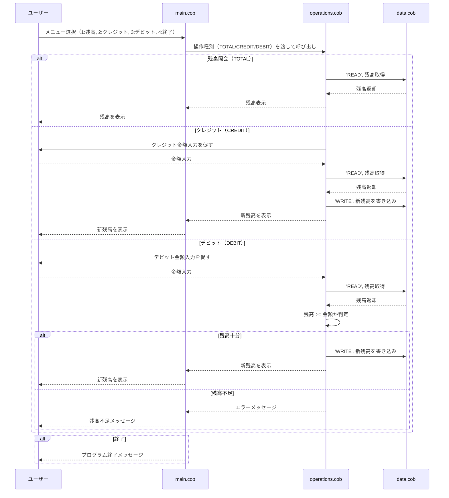

# COBOL 学生口座管理システム

このドキュメントは、学生口座管理システムのレガシー COBOL コードベースの概要を説明しています。

## 概要

このシステムは、学生口座を管理するコマンドラインアプリケーションで、ユーザーが残高を表示したり、口座にクレジットしたり、口座からデビットしたりできます。口座操作を処理するために連携した 3 つの COBOL プログラムを使用して構築されています。

---

## COBOL ファイル一覧

### 1. **main.cob** (メインプログラム)
**プログラムID:** MainProgram

#### 目的
アプリケーションのエントリーポイント。このプログラムはメニューインターフェースを表示し、口座管理システムとのユーザーインタラクションをオーケストレーションします。

#### 主要機能
- **メニュー表示**: ユーザーが口座と対話するためのオプションを表示
- **ユーザー入力処理**: ユーザー選択（1～4）を受け入れ
- **プログラムフロー制御**: ユーザーリクエストを適切な操作にルーティング
- **終了管理**: グレースフルなプログラム終了を処理

#### メニューオプション
1. 残高表示 - Operations プログラムを 'TOTAL' フラグで呼び出し
2. クレジット - Operations プログラムを 'CREDIT' フラグで呼び出し
3. デビット - Operations プログラムを 'DEBIT' フラグで呼び出し
4. 終了 - プログラムを終了

#### データ変数
- `USER-CHOICE`: メニュー選択の数値入力（1～4）
- `CONTINUE-FLAG`: メインループの実行を制御（'YES' または 'NO'）

---

### 2. **data.cob** (データ管理プログラム)
**プログラムID:** DataProgram

#### 目的
学生口座データの保存と取得を管理します。口座残高情報のデータアクセス層として機能します。

#### 主要機能
- **READ 操作**: 現在の口座残高を取得
- **WRITE 操作**: 口座残高を更新して永続化
- **データ抽象化**: 口座データ管理を一元化

#### ビジネスルール
- **初期残高**: 学生口座は 1000.00（通貨単位）の残高で開始
- **残高フォーマット**: すべての残高は 6 桁の数字で、小数点以下 2 桁（PIC 9(6)V99）として保存
- **データ永続化**: プログラム実行中、残高は STORAGE-BALANCE で保持

#### データ変数
- `STORAGE-BALANCE`: 現在の口座残高を保持（初期値：1000.00）
- `OPERATION-TYPE`: 操作を示す（'READ' または 'WRITE'）
- `BALANCE`: プログラム間で残高データを渡すためのリンケージセクション変数

---

### 3. **operations.cob** (業務ロジックプログラム)
**プログラムID:** Operations

#### 目的
残高照会、クレジットトランザクション、デビットトランザクション（検証ルール付き）を含む、コア口座操作を実装します。

#### 主要機能

##### **TOTAL 操作**
- 現在の口座残高を取得して表示
- 'READ' フラグで DataProgram を呼び出し
- 表示：「Current balance: [金額]」

##### **CREDIT 操作**
- 学生口座に資金を追加
- 手順：
  1. ユーザーにクレジット金額の入力を促す
  2. DataProgram から現在の残高を取得
  3. 金額を残高に追加
  4. 更新された残高を DataProgram に書き込み
  5. 新しい残高でトランザクションを確認

##### **DEBIT 操作**
- 検証を伴って学生口座から資金を引き出し
- 手順：
  1. ユーザーにデビット金額の入力を促す
  2. DataProgram から現在の残高を取得
  3. 十分な資金が利用可能かを検証
  4. 有効の場合：金額を減算して残高を更新
  5. 残高不足の場合：エラーメッセージを表示して処理しない
  6. トランザクションを確認（成功した場合のみ新しい残高を表示）

#### ビジネスルール

**残高確認ルール**
- デビットトランザクションは `FINAL-BALANCE >= AMOUNT` の場合のみ完了可能
- 残高不足の場合、トランザクションはメッセージ「Insufficient funds for this debit.」で拒否
- デビットが拒否された場合、口座残高は変わらない

**金額フォーマット**
- すべての金額は小数点以下 2 桁の数値として処理
- クレジット操作は常に成功（検証なし）
- デビット操作は利用可能な残高に対して検証

**学生口座制約**
- 口座はプラス操作とマイナス操作の両方をサポート
- クレジット操作の上限なし
- デビット操作は口座残高によって制限（透支を防止）

#### データ変数
- `OPERATION-TYPE`: 操作の種類（'TOTAL'、'CREDIT'、'DEBIT'）
- `AMOUNT`: クレジット或いはデビット対象の金額（ユーザー入力）
- `FINAL-BALANCE`: 計算に使用される現在の口座残高
- `PASSED-OPERATION`: 操作タイプを受け取るリンケージセクション変数

---

## システムアーキテクチャ

```
main.cob (ユーザーインターフェース)
    ↓ (Operations プログラムを呼び出し)
operations.cob (業務ロジック)
    ↓ (DataProgram を呼び出し)
data.cob (データ管理)
```

## 業務プロセスフロー

1. ユーザーがプログラムを起動（main.cob）
2. 終了が選択されるまでメニューがループで表示
3. ユーザーが操作を選択（1～4）
4. 選択した操作が Operations プログラムを呼び出し
5. Operations プログラムが適切なビジネスロジックを実行
6. 口座残高を読書きするため DataProgram を呼び出し
7. 結果がユーザーに表示
8. 制御がメインメニューに戻る（終了が選択された場合を除く）

---

## データ仕様

| 項目 | 型 | フォーマット | 目的 |
|------|-----|-----------|------|
| 口座残高 | 数値 | 9(6)V99 | 小数点以下 2 桁の学生口座残高を保存 |
| 操作タイプ | 文字 | X(6) | 実行する操作を特定 |
| ユーザー選択 | 数値 | 9 | メニュー選択入力（1～4） |
| トランザクション金額 | 数値 | 9(6)V99 | クレジット操作またはデビット操作の金額 |

---

## モダナイゼーション検討事項

- **エラーハンドリング不足**: 無効な入力に対するエラーハンドリングが限定的
- **ハードコード値**: 初期残高が data.cob にハードコードされている
- **データ永続化なし**: プログラム終了時に残高が失われる
- **認証なし**: ユーザー識別またはセキュリティ対策がない
- **検証が限定的**: デビット操作のみが残高確認を検証
- **監査証跡なし**: トランザクション履歴またはログメカニズムがない
- **基本的なUI**: 入力検証がないシンプルなテキストベースメニュー

---

## シーケンス図（データフロー）


